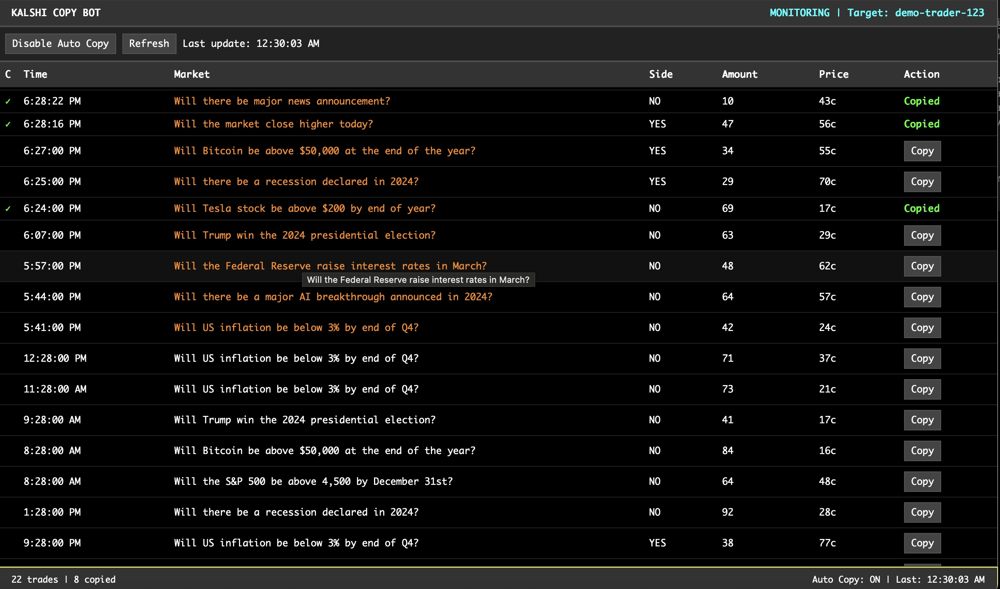

# Kalshi Copy Bot



A web-based application for monitoring and copying trades from target Kalshi users.

## Setup

1. Install dependencies:
```bash
python3 -m venv venv
source venv/bin/activate
pip install -r requirements.txt
```

2. Configure environment:
```bash
cp .env.example .env
```
Edit `.env` with your Kalshi credentials.

3. Run the application:
```bash
python app.py
```

For demo mode: `python app.py --demo`

4. Access the interface at http://localhost:5001

## Configuration

Set the following environment variables in `.env`:

- `KALSHI_EMAIL` - Kalshi account email
- `KALSHI_PASSWORD` - Kalshi account password  
- `TARGET_USER_ID` - User ID to monitor (optional)